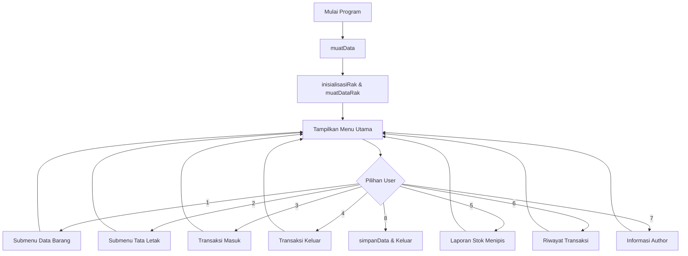

# Sistem Manajemen Gudang

---

## 1. Teknologi & Library yang Digunakan

Program ini menggunakan bahasa C standar dengan beberapa library bawaan:
*   `stdio.h`: Digunakan untuk operasi input-output standar seperti `printf`, `scanf`, `fopen`, `fprintf`, dll.
*   `stdlib.h`: Digunakan untuk alokasi memori dinamis (`malloc`), kontrol proses (`exit`), dan eksekusi perintah sistem seperti membersihkan layar (`system("cls")`).
*   `string.h`: Digunakan untuk manipulasi string (`strcpy`, `strlen`, `strcspn`, `strncpy`).
*   `conio.h`: Digunakan khusus pada sistem Windows untuk membaca input karakter secara langsung tanpa menekan enter (`getch()`), yang diimplementasikan pada fungsi jeda layar (`pressEnter()`).

---

## 2. Struktur Data Utama

Program ini menggunakan kombinasi struktur data statis (Array) dan dinamis (Linked List):

### A. Struct Barang (Statis - Array)
Digunakan untuk menyimpan informasi detail dari setiap barang.
```c
typedef struct {
    int id;             // ID Unik Barang
    char nama[50];      // Nama Barang
    char kategori[30];  // Kategori Barang (misal: Elektronik, Pakaian)
    int stok;           // Jumlah stok barang saat ini
    char lokasi[10];    // Kode lokasi fisik (misal: A1, B2)
} Barang;

// Deklarasi global
Barang daftarBarang[MAX_BARANG]; // Array statis penampung data barang
int jumlahBarang = 0;            // Counter jumlah barang aktif
```

### B. Struct Riwayat (Dinis - Single Linked List)
Digunakan untuk melacak riwayat transaksi secara dinamis selama program berjalan. Riwayat baru akan disisipkan di awal list (operasi *Prepend* / Stack-like insertion).
```c
typedef struct Riwayat {
    int idTransaksi;        // ID Transaksi (Auto-increment dimulai dari 1001)
    int idBarang;           // ID Barang yang ditransaksikan
    char namaBarang[50];    // Nama Barang saat transaksi terjadi
    int jumlah;             // Jumlah barang masuk/keluar
    char jenis[10];         // Jenis transaksi ("Masuk" atau "Keluar")
    char tanggal[20];       // Tanggal transaksi (Default hardcoded "2026-07-07")
    struct Riwayat* next;   // Pointer ke simpul riwayat berikutnya
} Riwayat;

// Deklarasi global
Riwayat* headRiwayat = NULL; // Pointer ke kepala linked list riwayat
```

### C. Matriks Rak Gudang (Array 2 Dimensi)
Digunakan untuk visualisasi tata letak barang secara grid 5x5 di dalam gudang.
```c
char rakGudang[MAX_RAK][MAX_RAK][10]; // Matriks string untuk menyimpan kode/ID barang
```

---

## 3. Sistem & Cara Kerja Program

Program ini bekerja secara prosedural berbasis menu interaktif dengan alur utama sebagai berikut:



### Penjelasan Mekanisme Kerja Fitur Utama:

1.  **Inisialisasi & Load Data (`main`):**
    *   Saat pertama kali dijalankan, program memanggil `muatData()` untuk membaca file database (`data_barang.txt` & `data_rak.txt`).
    *   Program memanggil `inisialisasiRak()` untuk mengisi sel rak yang kosong dengan string `"[Kosong]"` sebelum memuat posisi rak yang tersimpan.
2.  **Manajemen Data Barang:**
    *   **Tambah:** Menambahkan entri baru ke `daftarBarang` di indeks `jumlahBarang`. Batas maksimum ditentukan oleh `MAX_BARANG`.
    *   **Tampil:** Iterasi linear sepanjang `jumlahBarang` untuk mencetak tabel barang.
    *   **Cari:** Menggunakan metode **Linear Search** untuk mencari ID barang.
    *   **Ubah:** Mengedit nama dan stok barang yang sudah ada berdasarkan pencarian ID.
    *   **Hapus:** Menghapus barang dengan cara menggeser (*shifting*) elemen array setelah indeks barang yang dihapus ke arah kiri, lalu mengurangi `jumlahBarang`.
    *   **Urutkan:** Menggunakan algoritma **Bubble Sort** untuk mengurutkan daftar barang berdasarkan stok terkecil secara ascending.
3.  **Visualisasi Rak Gudang:**
    *   Rak direpresentasikan oleh matriks 2D berukuran $5 \times 5$.
    *   Pengguna dapat memvisualisasikan rak dalam bentuk tabel ASCII dan menempatkan ID/Kode barang ke koordinat Baris `[0-4]` dan Kolom `[0-4]`.
4.  **Transaksi Masuk & Keluar:**
    *   **Barang Masuk:** Menambah jumlah `stok` barang dan memanggil `catatRiwayat()`.
    *   **Barang Keluar:** Memvalidasi kecukupan stok terlebih dahulu sebelum mengurangi `stok` barang dan memanggil `catatRiwayat()`.
5.  **Laporan Gudang:**
    *   Melakukan filter dan menampilkan barang yang memiliki jumlah stok kurang dari atau sama dengan 5 (`stok <= 5`).
6.  **Riwayat Transaksi (Linked List):**
    *   Setiap transaksi masuk/keluar akan mengalokasikan node `Riwayat` baru secara dinamis menggunakan `malloc()`.
    *   Node baru ditambahkan ke bagian depan list (`headRiwayat`) untuk memastikan riwayat terbaru tampil di urutan paling atas (LIFO).
7.  **Persistensi File (File I/O):**
    *   Data disimpan secara otomatis saat user memilih menu **Keluar (Menu 8)**.
    *   **`data_barang.txt`:** Baris pertama menyimpan total barang, baris berikutnya menyimpan data dengan format *delimited text* `ID|Nama|Kategori|Stok|Lokasi`.
    *   **`data_rak.txt`:** Menyimpan status matriks rak baris demi baris.

---

## 4. Panduan Modifikasi & Kustomisasi

Berikut adalah beberapa bagian kode yang dapat disesuaikan untuk mengubah perilaku program:

### A. Mengubah Batas Maksimum Barang & Ukuran Rak
Jika kapasitas gudang ingin ditingkatkan atau grid rak ingin diperbesar, ubah konstanta preprocess pada bagian atas file:
*   File: `gudang.c` (Baris 6 & 7)
    ```c
    #define MAX_BARANG 200 // Ubah kapasitas maksimum penyimpanan barang
    #define MAX_RAK 10     // Mengubah matriks rak menjadi 10x10
    ```

### B. Mengubah Batas Minimal Stok Laporan (Threshold)
Secara default, laporan menampilkan barang dengan stok $\le 5$. Jika ingin mengubah batas ini menjadi $\le 10$:
*   File: `gudang.c` (Fungsi `tampilkanLaporan`)
    ```c
    // Cari baris kondisi stok pada fungsi tampilkanLaporan()
    if(daftarBarang[i].stok <= 10) { // Ubah angka 5 menjadi 10
    ```

### C. Menambahkan Field Baru pada Barang (Misal: Harga Barang)
Untuk menambahkan field `harga` pada barang:
1.  Tambahkan field di struct `Barang`:
    ```c
    typedef struct {
        int id;
        char nama[50];
        char kategori[30];
        int stok;
        char lokasi[10];
        long harga; // Tambahan field baru
    } Barang;
    ```
2.  Perbarui fungsi `tambahBarang()` untuk menginput harga:
    ```c
    printf("Harga Barang: ");
    scanf("%ld", &daftarBarang[jumlahBarang].harga);
    ```
3.  Perbarui fungsi `tampilkanBarang()`, `cariBarang()`, dan `ubahBarang()` agar menampilkan serta memproses field harga tersebut.
4.  Perbarui fungsi `simpanData()` dan `muatData()` untuk mendukung pembacaan/penulisan harga ke file `data_barang.txt`:
    ```c
    // Pada simpanData()
    fprintf(fBarang, "%d|%s|%s|%d|%s|%ld\n", ... , daftarBarang[i].harga);
    
    // Pada muatData()
    fscanf(fBarang, "%d|%[^|]|%[^|]|%d|%[^|]|%ld\n", ... , &daftarBarang[i].harga);
    ```

---

## 5. Cara Kompilasi dan Menjalankan

Program ini menggunakan header `<conio.h>` yang umum pada compiler Windows (GCC via MinGW, MSVC, atau Dev-C++).

### Kompilasi Menggunakan GCC (Terminal / Command Prompt):
```bash
gcc -o gudang gudang.c
```

### Menjalankan Program:
```bash
./gudang
```

> **Catatan Sistem:** Program ini menggunakan pembersih layar `system("cls")`. Jika Anda memigrasikan program ini ke sistem operasi Linux atau macOS, Anda perlu menyesuaikannya menjadi `system("clear")` dan mengganti penggunaan library Windows khusus seperti `<conio.h>` beserta fungsi `getch()` dengan fungsi alternatif Unix standar.
